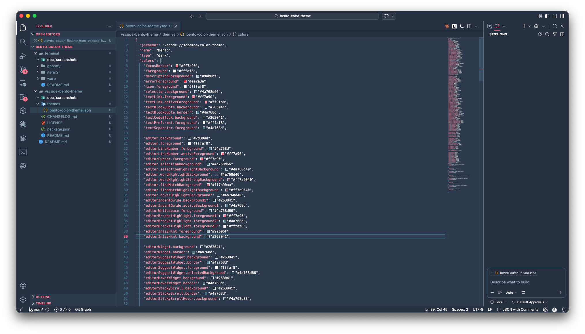

# Bento Color Theme

This directory packages a Bento-inspired palette for multiple apps.

## Original Source

The base palette is inspired by Monkeytype's `bento` theme definition in:

- `https://github.com/monkeytypegame/monkeytype.git`
- `/frontend/src/ts/constants/themes.ts`

Palette:

- `bg`: `#2d394d`
- `caret`: `#ff7a90`
- `main`: `#ff7a90`
- `sub`: `#4a768d`
- `subAlt`: `#263041`
- `text`: `#fffaf8`
- `error`: `#ee2a3a`
- `errorExtra`: `#f04040`

## What Is In Here

- `vscode-bento-theme/`: VS Code theme extension source
- `terminal/`: terminal presets for Warp, iTerm2, and Ghostty

## Current Values

### Base Palette Shared Across Targets

- `bg`: `#2d394d`
- `caret` / `main`: `#ff7a90`
- `sub`: `#4a768d`
- `subAlt`: `#263041`
- `text`: `#fffaf8`
- `error`: `#ee2a3a`
- `errorExtra`: `#f04040`

### Terminal Hint Contrast

Terminal presets use `bright black` = `#8da3b3` so autosuggestion/hint text is visible and distinct from typed command text.

## Screenshots

## What Was Extended

That source palette was adapted to:

- VS Code workbench colors, editor tokens, terminal ANSI colors, menus, inputs, sticky scroll, notifications, and other UI surfaces
- Warp terminal theme colors
- iTerm2 ANSI, cursor, selection, and terminal surface colors
- Ghostty palette, cursor, selection, and terminal surface colors

## License and Attribution

This project adapts the Monkeytype `bento` theme palette and mapping.

- Upstream inspiration/source: `monkeytypegame/monkeytype`
- Upstream license: GNU General Public License v3.0 (GPL-3.0)

This repository is licensed under GPL-3.0. See `LICENSE`.

Keep attribution and license notices when redistributing derivative versions.

## Install Targets

- VS Code: see `vscode-bento-theme/README.md`
- Terminal presets: see `terminal/README.md`
