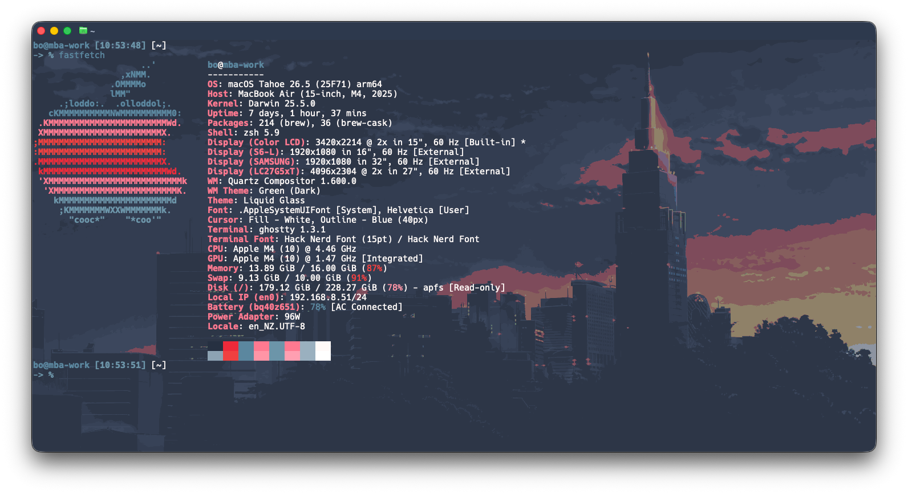
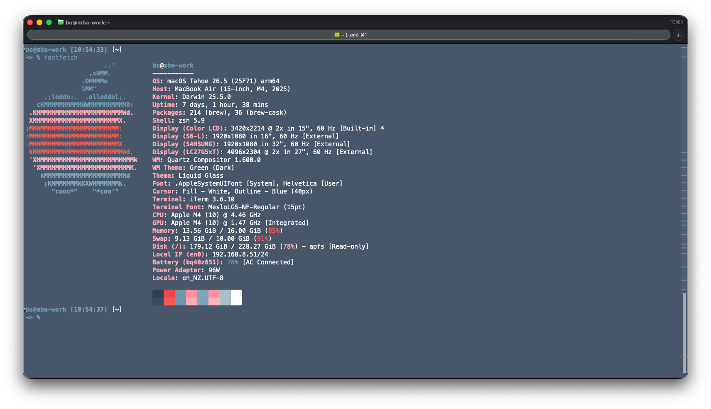
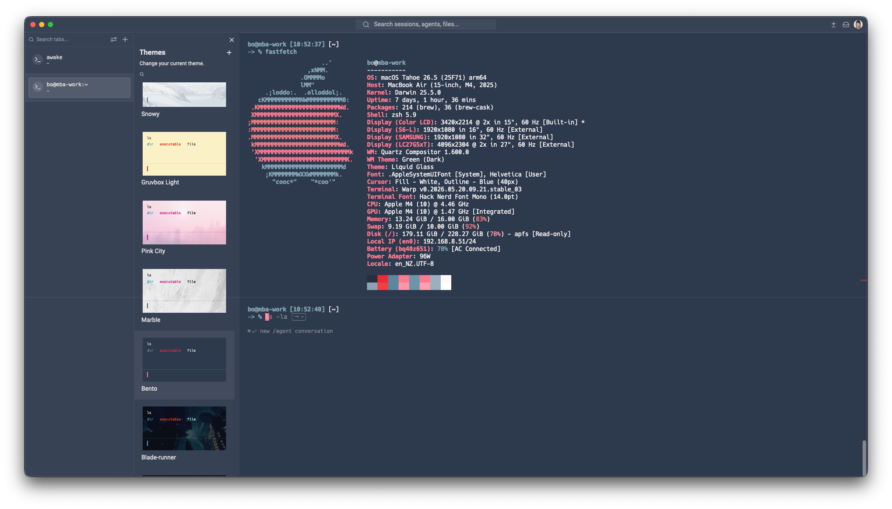

# Bento For Terminals

This directory contains terminal presets inspired by Monkeytype's `bento` theme.

## Source

The base colors are inspired by Monkeytype's `bento` theme in:

- `https://github.com/monkeytypegame/monkeytype.git`
- `/frontend/src/ts/constants/themes.ts`

## Targets

- `warp/`: Warp theme preset
- `iterm2/`: iTerm2 color preset
- `ghostty/`: Ghostty theme preset

## Current Values

All terminal presets in this directory use the same colors.

### Core

- Background: `#2d394d`
- Foreground: `#fffaf8`
- Cursor: `#ff7a90`
- Selection: `#4a768d` with light foreground text

### ANSI Normal

- black `#263041`, red `#ee2a3a`, green `#5b879f`, yellow `#ff7a90`
- blue `#6d95a9`, magenta `#ff7a90`, cyan `#9ab0bf`, white `#fffaf8`

### ANSI Bright

- black `#8da3b3`, red `#f04040`, green `#5b879f`, yellow `#ff95a6`
- blue `#6d95a9`, magenta `#ff9fb0`, cyan `#9ab0bf`, white `#ffffff`

## Screenshots

## Install

- Warp: see `warp/README.md`
- iTerm2: see `iterm2/README.md`
- Ghostty: see `ghostty/README.md`
